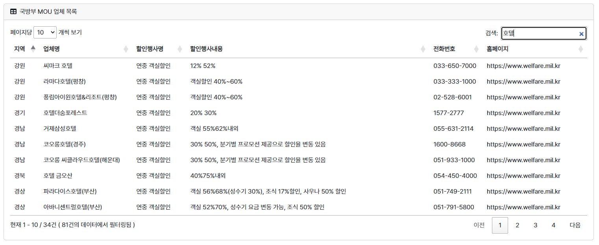

# ArmyPlanner
www.armyplanner.com (24.01.21 부로 서비스 중단)

<table>
	<tr>
		<td>
			
		</td>
	<tr>
		<td align="center">
			<b>소개 영상 (클릭 시 유튜브로 이동)</b>
		</td>
</table>

**11가지의 다양한 공공데이터 API를 통해 실시간으로 정보 제공 및 장병들이 직접 선택, 가공, 저장, 활용할 수 있도록 다양한 기능과 서비스를 제공하여 군생활을 알차게 계획하고 실행할 수 있는 통합 플랫폼 PC/모바일 웹사이트**   
 

## 👉  목차  
1. [📰 프로젝트 개요](#-프로젝트-개요)  
   - [🙋‍♀️ 참가자](#-참가자)
   - [📜 사용 공공데이터 API](#-사용-공공데이터-api)
2. [🛠 Tech Stacks](#-tech-stacks)
3. [💡 개발 배경](#-개발-배경)   
4. [🔔 기능](#-기능)
5. [📝 제작방향](#-제작방향)
   - [🚩 개발 절차](#-개발-절차)
   - [:octocat: Commit convention (커밋 컨벤션)](#octocat-commit-convention-커밋-컨벤션)
6. [⭐ skills](#-skills)
7. [📈 Release Note](#-release-note)   
8. [🚀 배포](#-배포)
9. [🙏 마무리하며..](#-마무리하며)

 

## 📰 프로젝트 개요

23년 국방공공데이터 활용 경진 대회 참가
### 🙋 참가자
상병 최성현
> "공공데이터를 단순히 보여주는 것을 넘어 사용자가 가공, 저장 등 다양한 방식으로 직접 사용할 수 있어야 한다! 공공데이터를 통해 새로운 가치를 만듭니다."  
    
### 📜 사용 공공데이터 API

1. <국가중점데이터> 식품의약품안전처_식품 영양성분 정보    
  https://www.data.go.kr/data/15057436/openapi.do 
2. <국가중점데이터> 기상청_중기예보 조회서비스    
  https://www.data.go.kr/data/15059468/openapi.do  
3. <국방분야데이터> 국방부 PX 인기상품 정보 : PX 인기상품 정보  
 https://opendata.mnd.go.kr/openinf/sheetview2.jsp?infId=OA-9491      
4. <국방분야데이터> 전군 복지 휴양시설 위치정보 목록 : 군 복지 휴양시설 정보  
 https://opendata.mnd.go.kr/openinf/sheetview2.jsp?infId=OA-9441     
5. <국방분야데이터> 군병원 정보 : 군병원 정보  
 https://opendata.mnd.go.kr/openinf/sheetview2.jsp?infId=OA-9436    
6. <국방분야데이터> TMO(여행장병 안내소) 정보 : TMO(여행장병 안내소) 정보  
 https://opendata.mnd.go.kr/openinf/sheetview2.jsp?infId=OA-9595
7. <국방분야데이터> 병사 할인 혜택 정보 : 병사 할인 혜택 정보  
 https://opendata.mnd.go.kr/openinf/sheetview2.jsp?infId=OA-9493       
8. (자치행정기관데이터) 경기도 포천시_군장병할인업소 현황 데이터  
 https://www.data.go.kr/data/15106202/fileData.do    
9. (자치행정기관데이터) 충청남도 논산시_할인업소현황 데이터  
 https://www.data.go.kr/data/3073444/fileData.do    
10. (자치행정기관데이터) 경상북도 영천시_군장병 할인업소현황  
 https://www.data.go.kr/data/15044647/fileData.do    
11. (자치행정기관데이터) 경상남도 창원시_입영장병 가족할인업소현황  
 https://www.data.go.kr/data/15055435/fileData.do  

 
  
   

## 🛠 Tech Stacks

    
 
        
        
        
        
         
        
        
        
    

  
     

## 💡 개발 배경
- 군 생활이 얼마 남지 않은 요즘 이때까지의 군 생활을 되돌아보면 물 흐르듯 지내는 것보다는 계획적으로 할 일을 정하고, 목표를 세우고, 남는 시간을 활용하여 자기 계발을 시작하고 나서가 긍정적인 영향과 성취감을 가져다주고 시간도 금세 지나가는 것 같았음.   
하지만 주변 동기나 후임들을 계획적인 군 생활을 시도했다가 쉽게 포기하는 것을 보고 어떻게 하면 군 생활 동안의 목표를 쉽게 계획하고 실천할 수 있을까 고민하다가 서비스 개발을 결심함.  
 

## 🔔 기능

**1. 회원 기능**

|회원가입|로그인|
|---|---|
|||

**2. 나의 Planner 서비스**
   - 월, 주, 일, 리스트 단위로 볼 수 있음.
  
   |기본 월단위 뷰|주단위 뷰|
   |---|---|
   |||
   |일단위 뷰|리스트 뷰|
   |||
   
   - 휴가, 식단, 소비, 장소, 텍스트 등 다양한 종류의 일정(기록) 추가/삭제
  
   |일정 유형 선택|휴가 등록|
   |---|---|
   |||
   |식단 기록 등록|소비 기록 등록|
   |||
   |장소 등록|텍스트 등록|
   |||

   - 일정 상세 정보 보기
  
   |휴가 상세|식단 기록 상세|소비 기록 상세|
   |---|---|---|
   ||||
   |장소 상세|텍스트 상세|
   |||
   
**3. 군혜택MAP 서비스**
   - 키워드로 장소 검색

   |키워드로 장소 검색|
   |---|
   ||
   
   - 군인 전용 장소 보기 (군 복지 휴양 시설, 군 병원, TMO)
  
   |군인 전용 장소 보기|
   |---|
   ||
   
   - 군인 우대 업소 보기
      
   |군인 우대 업소 보기|
   |---|
   ||
      
   - 관심 장소 추가 기능
   
   |관심 장소 추가|
   |---|
   ||
   
**4. 기타 군혜택 페이지**
   - 국방부 MOU 혜택 정보 페이지 
    
   |국방부 MOU 혜택 정보 페이지|
   |---|
   ||

**5. 회원 전용 홈 서비스(전국 중기예보전망, 전날 식단 영양소 분석, 일/월별 소비 기록 분석), + AI를 이용한 예상치, 예정된 방문 장소 알림 기능 추가 예정**
   
   |대시보드(회원 홈)|
   |---|
   ||

 

## 📝 제작방향  
23.06.01 ~ 23.07.09

### 🚩 개발 절차
0. 스프링 부트 프로젝트 생성, sqlite3 DB 사용
1. 기본 회원기능 구현(회원가입, 로그인, 세션...)
2. 나의 Planner 서비스 구현, 모달 창 구현, 기본 텍스트 CRUD구현, sqlite로 DB 변경
3. 나의 Planner 기능 추가 - 식단, 소비 기록, 장소 기록 (공공데이터 API AJAX를 통해 가져오기, 데이터 가공 및 표현 알고리즘 구현)
4. 군혜택 MAP 서비스 (공공데이터 API AJAX를 통해 가져오기, 데이터 가공 및 표현 알고리즘 구현)
5. 회원 전용 홈 구현
6. 기본 웹 디자인
7. 기타 군혜택 페이지 구현
8. 플래너 디자인 강화  
9. index 강화
10. 1차 배포-aws 배포, 도메인 등록
11. 모바일을 위한 최적화 (글씨 드래그 방지 등)
12. 사용법 명시 및 설명 추가
13. api 코드 삭제 후 커밋, 재발급 하여 새로운 코드로 서버 가동
14. 2차 최종 배포 

-------정식 서비스 ------  
15. 회원 기능 및 보안 강화   
16. 회원 전용 홈 서비스 강화(AI를 사용하여 다양한 데이터 추천)  
16. 어드민, 매니저 기능 구현  
17. 군 우대 업소 정보에 리뷰기능 구현, 게시판 기능을 통해 커뮤니티 활성화  
18. 친구기능과 공유 플래너 기능 구현  

###  :octocat: Commit convention (커밋 컨벤션)
feat : 새로운 기능과 관련된 것  
fix : 오류와 같은 것을 수정  
hotfix : 급하게 치명적인 버그 수정  
design : css 등 사용자 UI 디자인 변경  
test : test를 추가하거나 수정  
docs : 문서와 관련하여 수정한 부분이 있을 때 사용한다.  
style : 코드의 변화와 관련없는 포맷이나 세미콜론 수정  
refactor : 코드의 리팩토링  
build : 빌드 관련 파일 수정에 대한 커밋  
chore : 패키지 매니저 설정 등 여러가지 (production code와 무관)  
rename : 파일 혹은 폴더명 수정 또는 옮김  
remove : 파일을 삭제  

## ⭐ skills

### 프론트엔드(front-end)
- Html5, css
- Javascript
- Thymeleaf   
- Bootstrap 5.3.0
- Jquery 3.5.1
 
### 백엔드(back-end)
- Java 11  
- Springboot 2.7.12  
- MySql

### API
- 11가지의 공공데이터 API
- 카카오MAP API : 정적, 동적 지도 생성
- 구글캘린더 API : 공휴일 가져오기

  

## 📈 Release Note

| version | log |
| --- | --- |
| beta_v1 | 1차 배포 - AWS EC2, RDS |
| beta_v2 | 2차 배포 - 로딩 시 로딩 바 구현, 디자인 변경, 각종 효과 추가, 모바일 최적화, 각종 버그 수정, API키 교체 |  

 

## 🚀 배포 
AWS (아마존 웹 서비스)
- EC2 : Ubuntu Server 22.04 LTS
- RDS : MySQL Community

 

## 🙏 마무리하며..
 이번 프로젝트를 한 달 동안 준비하면서 많은 문제들이 있었다. 군인 신분이기에 남들보다 준비할 수 있는 시간이 적어 일과 시간 외 거의 모든시간을 사지방에서 서비스를 개발하는데 전념했다. 사지방 PC는 재부팅 시 초기화되기 때문에 저장을 못한다. 그래서 프로젝트를 깃과 깃허브를 통해 저장하였다. 그렇지만 매번 intellij와 MySQL을 설치하는 것은 시간이 오래 걸리고 귀찮음의 반복이었지만 견디고 견뎌 잘 완성할 수 있었다.
 군인 신분으로서의 한계는 여기서 끝이 아니었다. 서비스를 AWS를 통해 배포할 때 EC2 우분투 서버에 원격 접속해서 빌드된 파일을 전송하여 nohup으로 구동해야 하는데 사지방 pc는 원격 접속이 막혀 있었다. 그래서 접속뿐만 아니라 파일 전송도 불가능해서 위기였다. 그러나 다행히도 원격접속은 AWS 웹사이트에서 브라우저로 할 수 있는 서비스가 있었고 파일 전송은 구글 드라이브에 업로드 한 뒤 우분투 서버 내에서 wget로 쿠키를 무시하여 다운받는 편법이 있었다. 이런저런 문제를 많이 겪어보고 결국 해결하여 완성함으로써 이번 프로젝트는 나에게 큰 자신감과 뿌듯함을 가져다주었다.
